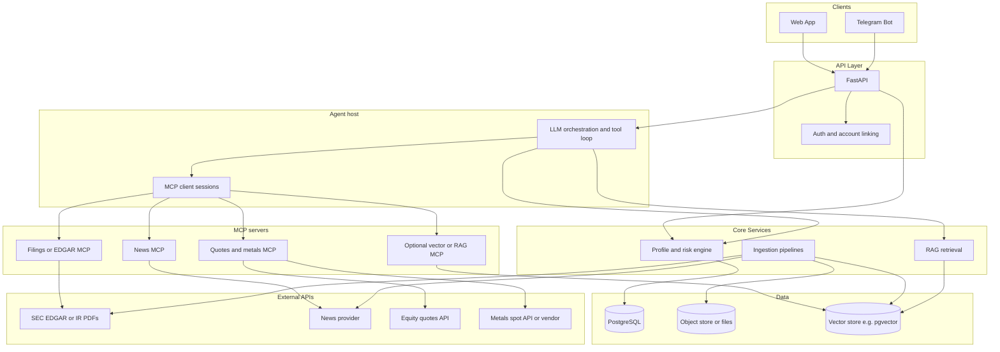

# Financial Advisor

A Python-based assistant that helps users think about wealth, risk-appropriate allocation, and company-level context—delivered through a **web application** and **Telegram**. Reasoning is **LLM-assisted**, grounded in **retrieved documents and live market snapshots** where available.

> **Disclaimer (product):** This project is intended for **educational and informational** use. It is **not** personalized investment, tax, or legal advice unless reviewed and licensed appropriately for your jurisdiction. Outputs may be wrong, incomplete, or based on delayed or partial data.

---

## Goals

| Capability | Description |
|------------|-------------|
| **Risk-aware guidance** | Capture goals, horizon, and risk tolerance; map to allocation **bands** and strategic framing. |
| **LLM narrative** | Turn structured outputs (allocations, facts, citations) into clear explanations and tradeoff discussions—without inventing core numbers. |
| **Company context** | Support questions about specific companies using **recent news** and **annual / regulatory filings** (e.g. US 10-K) via retrieval-augmented generation (RAG). |
| **Market awareness** | Incorporate **current equity quotes** and **commodity / alternative asset** reference prices so answers are time-stamped and strategically relevant. |
| **Multi-channel** | Same backend serves **Web** and **Telegram** (bot + optional Telegram Mini App for richer forms). |
| **MCP-backed retrieval** | External and semi-external data is exposed to **AI agents** through **[Model Context Protocol](https://modelcontextprotocol.io/) (MCP)** servers (tools/resources), so agents fetch facts via a **controlled, auditable** interface. |

---

## High-level architecture



**Principle:** Business rules, numeric policies, and **validated snapshots** still live in **Python domain code**. **AI agents** obtain **live or retrieved external facts** by calling **MCP tools** (and reading **MCP resources** where appropriate), not by ad hoc HTTP from the model. The LLM **explains and synthesizes** using **structured inputs** and **tool results** you attach to the trace; citations and `as_of` metadata travel with those results.

---

## Model Context Protocol (MCP)

[MCP](https://modelcontextprotocol.io/) standardizes how a **host** (your advisor runtime) connects to **servers** that expose **tools**, **resources**, and optional **prompts**. For this project, MCP is the **primary integration surface for agents** when pulling external or semi-external data.

### Why MCP here

| Benefit | Detail |
|---------|--------|
| **Clear boundary** | Agents call named tools with schemas; implementations (EDGAR, news, quotes) stay in small processes or packages. |
| **Reuse** | The same MCP servers can be used from **Cursor**, local dev, or your FastAPI-hosted agent with consistent behavior. |
| **Auditability** | Each advice run can log **which tools** ran, **arguments**, and **returned payloads** (redacted as needed). |
| **Secrets isolation** | API keys for vendors live in **MCP server** env/config, not in the model prompt. |

### Server boundaries (suggested split)

You can start with **one** `financial-data` MCP server and split later for blast radius and scaling.

| MCP server (example) | Tools / resources (examples) |
|----------------------|--------------------------------|
| **Filings** | `fetch_filing_text`, `list_recent_filings`, resource URI per accession or cached path. |
| **News** | `search_company_news`, `get_article` with URL and published time in the payload. |
| **Markets** | `get_equity_quote`, `get_metal_spot`; returns price, currency, `as_of`, source, delay flag. |
| **Retrieval (optional)** | `semantic_search_filings` backed by pgvector, or expose **resources** for pre-indexed doc slices. |

**Ingestion pipelines** (batch fetch, chunk, embed) remain **scheduled jobs** in the main app; MCP tools **read** what ingestion wrote, or call **live** APIs when freshness matters. Avoid duplicating logic: shared library used by both ingestion and MCP server is fine.

### Transport and deployment

- **stdio:** Simple for local dev and subprocess-spawned servers from the FastAPI host.
- **SSE / remote:** For production, run MCP servers as **separate services** if you need independent scaling or network policies.

The official SDKs and docs cover [Python server and client](https://github.com/modelcontextprotocol) usage; align with the transport your host supports.

### Agent integration

1. **Tool loop:** The LLM proposes tool calls → **MCP client** executes → results are appended to the conversation → final answer is validated (Pydantic) and returned to Web/Telegram.
2. **Non-agent paths:** Simple CRUD and risk scoring can bypass MCP; only **agent-driven advice** (or “research mode”) must use MCP for external facts so behavior stays consistent.
3. **Grounding rule:** The system prompt states that **numeric claims** about markets or filings must come from **tool results** (or pre-fetched snapshots injected by your code), never from model memory.

---

## Design principles

1. **Single source of truth** — Domain logic (risk bands, allocation rules, validation) is implemented once and invoked from both Web and Telegram.
2. **Structured contracts** — Pydantic models for profiles, `AdvicePayload`, `MarketSnapshot`, retrieval chunks with metadata, and LLM outputs (JSON / structured parsing with validation and optional repair pass).
3. **Grounding over fluency** — Financial figures and “facts” must come from **APIs or retrieved documents** with **citations** (filing id, section, URL, published time). If data is missing, the system states that explicitly.
4. **Explicit time and source** — Every price and document-backed claim carries **`as_of`**, **data delay** (if applicable), and **provider**.
5. **Defense in depth for prompts** — System prompts define role (educational), boundaries, and “do not fabricate numbers.” User-facing copy repeats that limitations apply.

---

## Component design

### API layer (FastAPI)

- **REST** (or GraphQL later) endpoints for: user profile, risk questionnaire, advice requests, optional admin/ingestion triggers.
- **Authentication:** sessions or JWT for web; **Telegram user linking** (e.g. OAuth on web + one-time pairing code, or signed deep links) so one logical user spans channels.
- **OpenAPI** documentation for contract-first development.

### Profile and risk engine

- Questionnaire → **risk score or band** → **target asset allocation ranges** (e.g. equity / fixed income / cash), parameterized by horizon and constraints.
- Outputs a **structured object** consumed by the LLM layer and UI; the model does not redefine the bands unless you explicitly choose a research mode that still gets validated against guardrails.

### Market data (domain + MCP)

- **Domain / cache layer:** Optional shared module implementing **`get_equity_quotes`**, **`get_precious_metal_spots`**, TTL caching, and normalization—used by **MCP market tools** and by **batch jobs** that precompute snapshots.
- **MCP exposure:** Agents call MCP tools (e.g. `get_equity_quote`) so quotes always carry **timestamp, source, and delay** in the tool result.
- **`get_precious_metal_spots(...)`** — If “precious” refers to **metals** (gold, silver, platinum): integrate a **spot / commodity** data vendor; same snapshot pattern as equities.
- **Gemstones (diamonds, colored gems):** There is typically **no universal spot ticker**. Design options: (a) **benchmark ranges** from an allowed industry index or manual reference table with date and source, or (b) scope the feature to **metals** only and document the limitation. The README and product should **not** imply precision that the market does not support.

### Ingestion and RAG

- **Filings / annual reports:** Start with a clear scope (e.g. **US-listed → SEC EDGAR 10-K**). Pipeline: fetch → extract text (HTML or PDF) → chunk → embed → index with metadata (`ticker`, `cik`, `accession`, `filing_date`).
- **News:** Ingest per ticker or company with `{title, url, published_at, snippet}`; optional quality or allowlist rules to reduce noise.
- **Retrieval:** Vector search filtered by ticker/document type; later **hybrid** (keyword + embedding) for filings. Retrieved chunks are passed into the LLM with **citation requirements**.
- **MCP alignment:** Expose retrieval and “fetch latest filing” as **MCP tools** (or **resources**) so the **agent** is the caller; ingestion remains the writer to Postgres/object store/vectors.
- **Orchestration:** Implement with a thin custom pipeline or libraries such as **LangChain** / **LlamaIndex**—keep boundaries so domain logic stays testable without the framework. If the framework supports MCP as tools, you can attach your **MCP client** there; otherwise invoke the official **MCP Python client** from your agent loop.

### LLM orchestration

- **Inputs:** User message + profile/risk summary + optional pre-fetched `MarketSnapshot` + **MCP tool results** (filings, news, quotes) with explicit instructions to cite sources.
- **Outputs:** Validated structured JSON (e.g. summary, thesis, risks, monitoring items, `sources_used`) plus optional user-facing markdown for Telegram/Web.
- **Provider access:** e.g. **LiteLLM** or a single vendor SDK; configure via environment variables.
- **MCP client:** One session (or pool) per request or user according to your scaling model; enforce **timeouts**, **max tool rounds**, and **allowlists** of tool names per endpoint.

### Telegram integration

- **python-telegram-bot** (v20+) with **webhooks** in production.
- Commands (examples): `/profile`, `/risk`, `/advice`, `/company AAPL`.
- Heavy forms or long reports: **Telegram Mini App** (embedded web) posting back to the same API.

### Web application

- Any stack that talks to the same API (e.g. React/Vue/Svelte or a Python full-stack template). Richer charts and onboarding live here; logic remains server-side.

---

## Data stores

| Store | Purpose |
|-------|---------|
| **PostgreSQL** | Users, linked Telegram IDs, profiles, risk results, ingestion job state, optional conversation metadata. |
| **pgvector** (or dedicated vector DB) | Embedding index for filing and news chunks. |
| **Object storage or local files** | Raw PDFs/HTML artifacts for audit and reprocessing. |

---

## Security and privacy

- Secrets only via environment or a secret manager; never commit API keys.
- Encrypt data at rest where hosting allows; use TLS for all public endpoints.
- Minimize PII in logs; redact or hash prompts if retained for debugging.
- Rate limiting on public routes (especially LLM and ingestion) to control cost and abuse.

---

## Compliance and product risk (non-legal summary)

- **Company-specific “who to invest in”** and **personalized** guidance may be regulated as investment advice in many jurisdictions.
- Prefer **educational framing**, **source citations**, and clear **“not a fiduciary / not tax or legal advice”** language.
- **Delayed or partial market data** and **RAG gaps** must be visible to the user.
- Engage qualified counsel before marketing this as a consumer financial product.

---

## Suggested technology stack

| Area | Choice |
|------|--------|
| Runtime | Python 3.11+ |
| API | FastAPI |
| Validation / settings | Pydantic v2, pydantic-settings |
| Database | PostgreSQL + SQLAlchemy 2 / SQLModel |
| Vector search | pgvector |
| LLM | LiteLLM or vendor SDK |
| Agent I/O | [MCP](https://modelcontextprotocol.io/) — Python SDK for servers and client in the host |
| Telegram | python-telegram-bot |
| Async tasks (later) | ARQ or Celery |

---

## Phased delivery

1. **Foundation** — FastAPI app, user/profile/risk models, allocation rules, `POST /advice` returning structured + LLM narrative (no RAG yet).
2. **MCP skeleton** — One MCP server with a trivial tool (e.g. health/ping) and the FastAPI host running an **MCP client** in the agent path; add **quotes** and **filing fetch** tools next.
3. **Market snapshot** — Equity quotes + (optional) metals spot **via MCP tools**; inject results into the tool loop with strict “no invented prices” rules.
4. **Single-market filings RAG** — e.g. 10-K only: ingest, retrieve; expose **search / fetch** via MCP; answer with citations.
5. **News RAG** — Ticker-scoped news MCP tools; dates and URLs in citations.
6. **Telegram + Web** — Linked accounts; bot commands and web UI sharing the same endpoints.
7. **Hardening** — Hybrid search, monitoring, cost controls, tool allowlists, and legal copy review.

---

## Repository layout (target)

```text
FinancialAdvisor/
  README.md                 # This document
  app/
    api/                    # FastAPI routers (webhooks, REST)
    domain/                 # Risk, allocation, pure business logic
    services/               # Ingestion orchestration, shared market clients
    llm/                    # Prompts, structured output, LLM provider; MCP host / agent loop
    integrations/           # Telegram adapters
  mcp_servers/              # One package per MCP server (or subfolders)
    filings/                # EDGAR / IR tools
    news/
    markets/                # Quotes + metals
  tests/
  pyproject.toml or requirements.txt
```

(Exact names can evolve; keep **domain** free of FastAPI and Telegram imports for testability.)

---

## Configuration (conceptual)

Environment variables might include: database URL, LLM API keys, equity quote API key, news API key, EDGAR or storage paths, Telegram bot token and webhook URL, embedding model id, MCP transport settings (e.g. server command lines or SSE URLs), and feature flags (e.g. `ENABLE_GEMSTONE_BENCHMARKS=false`).

---

## Open decisions

- **Markets:** US-only first vs multi-country filings and languages.
- **Gem vs metal:** Product scope for “precious stone” pricing (see Market data service).
- **Hosting:** Single VPS vs managed DB + serverless workers for ingestion.
- **MCP topology:** Monolithic MCP server vs one server per domain; stdio (subprocess) vs remote SSE for production.
- **MCP vs direct API:** Whether non-agent endpoints (e.g. dashboard widgets) call shared Python services only, or also go through MCP for parity.

---

## License

To be determined by the project owner.
